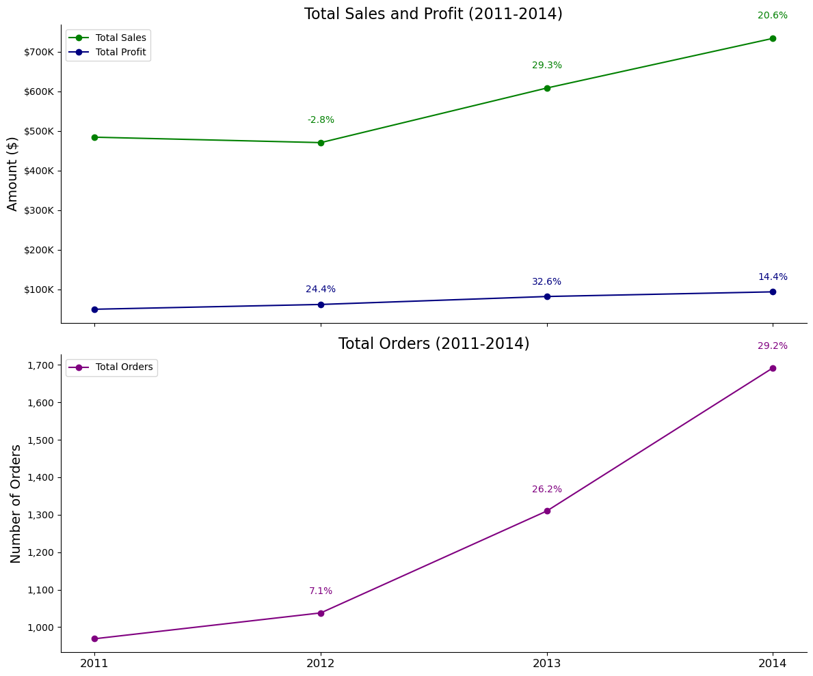
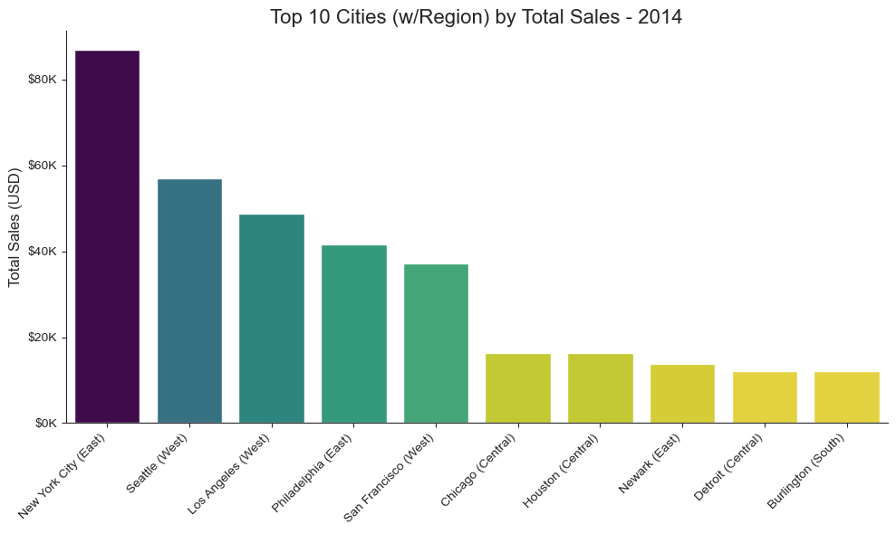
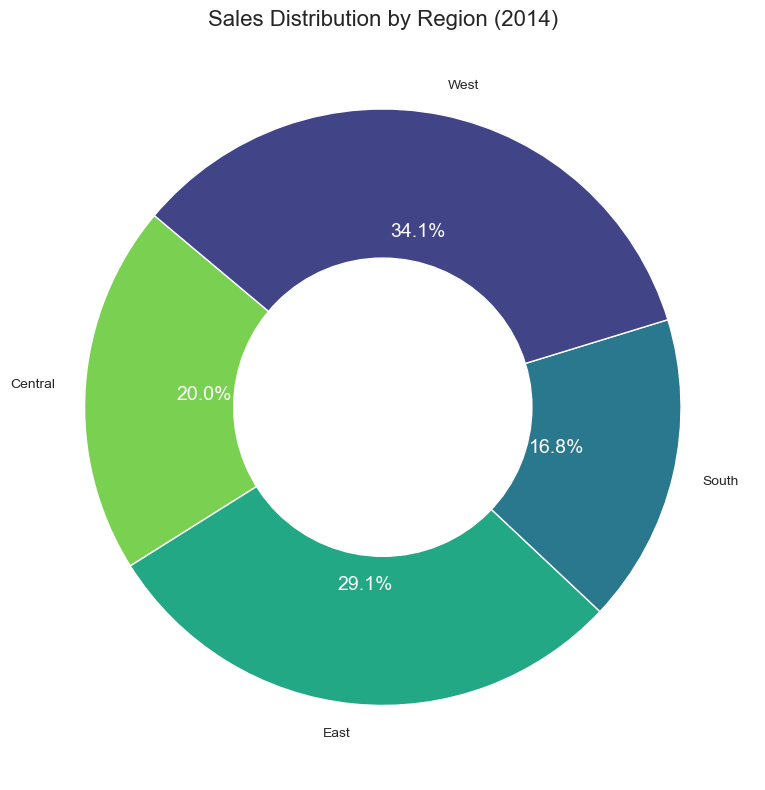
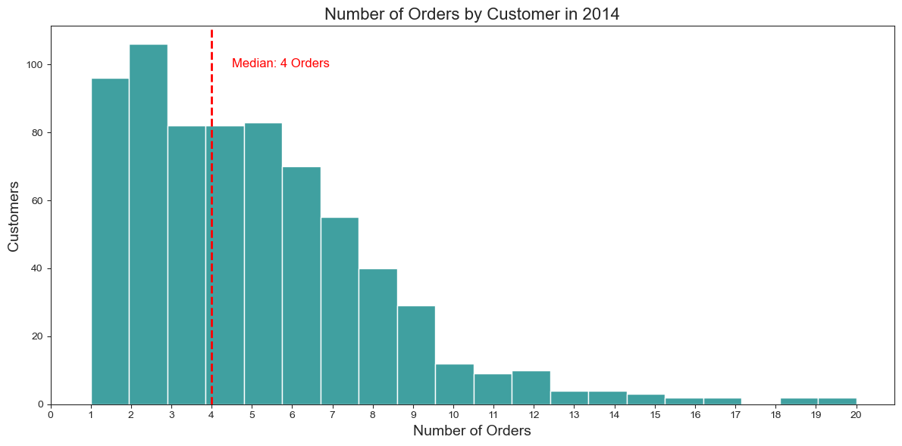
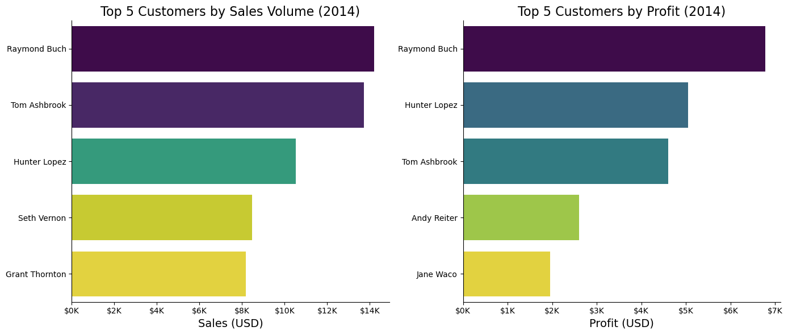
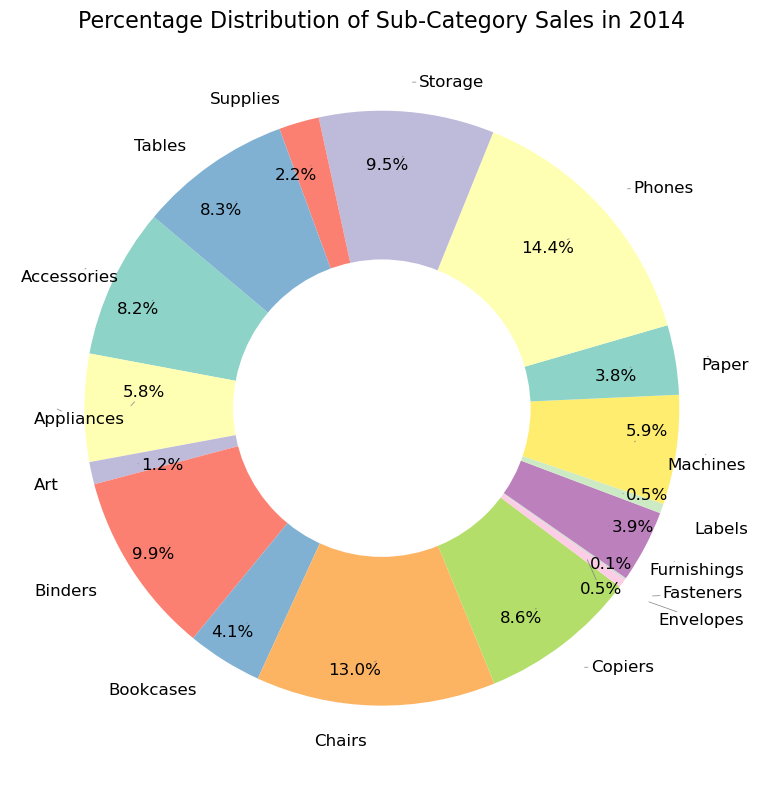
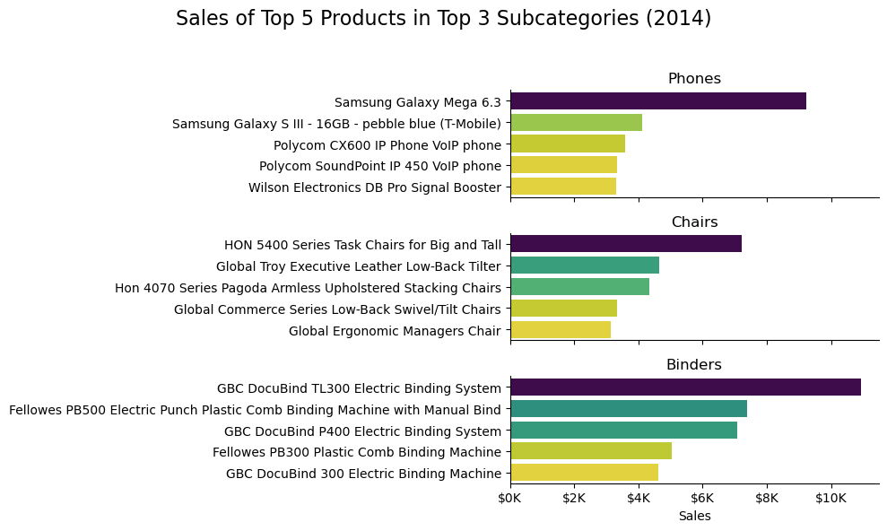
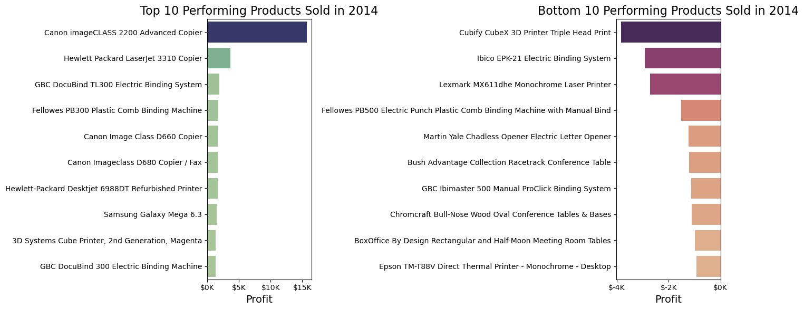

# The Analysis

## Introduction
In this analysis, I utilized the Superstore Dataset from Kaggle, comprising approximately 10,000 order entries spanning from 2011 to 2014. The primary objective was to uncover valuable insights into business analytics by examining key metrics such as sales, profit, and order volumes.

A significant focus was placed on customer data to identify the geographic distribution of our top clients, specifically analyzing orders by city and region. Furthermore, I sought to pinpoint the top customers by order volume and profitability.

In addition to customer insights, I explored product performance to determine which sub-categories yielded the highest order volumes. This involved identifying the top five products in terms of sales across the three leading sub-categories. I also assessed the performance of products by analyzing the top ten highest-performing products based on profit and the ten least-performing products to provide a comprehensive view of our offerings.

The insights garnered from this analysis aim to inform strategic decision-making and enhance our understanding of market trends and customer behavior.

## The Questions
Below are the questions I want to answer in my project:

1. What are the trends in Sales, Profit, and Orders over the period from 2011-2014?
2. Which locations and regions generate the highest customer purchases?
3. What is the distribution of sales between regions?
4. What is the distribution of order sizes among our Customers?
5. Who are the top customers by sales volume and profit?
6. Which sub-categories contribute the highest revenue to overall sales? 
7. What are the Top 5 Selling Items in each of the Top 3 Sub-Categories?
8. What are the top 10 most profitable products and the 10 least profitable products?

## Tools Used for the Analysis
I used the following tools for this analysis:

* <u>Python</u>: The main tool fo rthe analysis, used to analyze the data, and find the answer to the questions posed. The following libraries were used in Python:
    * Pandas Library: Used to analyze data.
    * Matplotlib Library: To visualize the data.
    * Seabormn Library: Create more advanced visualizations.
* <u>Jupyter Notebooks</u>: Tool used to run Python scripts, and easily include notes and analysis.
* <u>Visual Studio Code</u>: Program for executing Python scrpits.
* <u>Git & GitHub</u>: Version control and sharing Python code and analysis.

## Install Libraries, Load Dataset, and Clean Data

``` python
import pandas as pd
import matplotlib.pyplot as plt  
import seaborn as sns
from adjustText import adjust_text


# Use a raw string to avoid escape sequence issues and specify encoding
df = pd.read_csv(r"c:/Users/rbrod/OneDrive/Documents/RB_Python_SuperStore_Project/Dataset/SuperstoreCSV.csv", encoding='ISO-8859-1')

# Convert the Order Date, and Ship Date column to datetime
df['Order Date'] = pd.to_datetime(df['Order Date'], format='%d-%m-%Y')
df['Ship Date'] = pd.to_datetime(df['Ship Date'], format='%d-%m-%Y')

# Format Customer Name to title case
df['Customer Name'] = df['Customer Name'].str.title()

```

## Financial Performance Overview: 2011-2014
### What are the trends in Sales, Profit, and Orders over the period from 2011-2014?

``` python
# Extract Year from 'Order Date'
df['Year'] = df['Order Date'].dt.year

# Group by Year to aggregate metrics
yearly_summary = df.groupby('Year').agg(
    Orders=('Order ID', 'nunique'),  # Count of unique orders
    Sales=('Sales', 'sum'),          # Total sales
    Profit=('Profit', 'sum')         # Total profit
).reset_index()

# Calculate Year-over-Year growth percentages
yearly_summary['Sales Growth %'] = yearly_summary['Sales'].pct_change() * 100
yearly_summary['Profit Growth %'] = yearly_summary['Profit'].pct_change() * 100
yearly_summary['Order Growth %'] = yearly_summary['Orders'].pct_change() * 100

# Set up the figure and two subplots
fig, (ax1, ax2) = plt.subplots(2, 1, figsize=(12, 10), sharex=True)

# Plot Sales and Profit on the first subplot
ax1.plot(yearly_summary['Year'], yearly_summary['Sales'], label='Total Sales', marker='o', linestyle='-', color='green')
ax1.plot(yearly_summary['Year'], yearly_summary['Profit'], label='Total Profit', marker='o', linestyle='-', color='navy')
ax1.set_title('Total Sales and Profit (2011-2014)', fontsize=16)
ax1.set_ylabel('Amount ($)', fontsize=14)
ax1.legend()

# Format y-axis for Sales and Profit subplot (e.g., $600K, $500K)
ax1.yaxis.set_major_formatter(plt.FuncFormatter(lambda x, _: f'${int(x / 1_000):,}K'))

# Add growth labels with upward offset for Sales and Profit
for i in range(1, len(yearly_summary)):
    ax1.text(
        yearly_summary['Year'][i], yearly_summary['Sales'][i] + 50_000,  # Offset by 50,000
        f'{yearly_summary["Sales Growth %"][i]:.1f}%', 
        ha='center', color='green', fontsize=10
    )
    ax1.text(
        yearly_summary['Year'][i], yearly_summary['Profit'][i] + 30_000,  # Offset by 30,000
        f'{yearly_summary["Profit Growth %"][i]:.1f}%', 
        ha='center', color='navy', fontsize=10
    )

# Plot Total Orders on the second subplot
ax2.plot(yearly_summary['Year'], yearly_summary['Orders'], label='Total Orders', marker='o', linestyle='-', color='purple')
ax2.set_title('Total Orders (2011-2014)', fontsize=16)
ax2.set_ylabel('Number of Orders', fontsize=14)
ax2.legend()

# Format y-axis for Orders with commas
ax2.yaxis.set_major_formatter(plt.FuncFormatter(lambda x, _: f'{int(x):,}'))

# Add growth labels with upward offset for Orders
for i in range(1, len(yearly_summary)):
    ax2.text(
        yearly_summary['Year'][i], yearly_summary['Orders'][i] + 50,  # Offset by 50
        f'{yearly_summary["Order Growth %"][i]:.1f}%', 
        ha='center', color='purple', fontsize=10
    )

# Set x-ticks and labels for years
ax2.set_xticks(yearly_summary['Year'])
ax2.set_xticklabels(['2011', '2012', '2013', '2014'], fontsize=12)

# Adjust layout
sns.despine()
plt.tight_layout()
plt.show()

```

*Line chart showing the Total Sales, Profit, and Orders for (2011-2014)*

### Insights:
* The overall sales and profit experienced a steady increase through 2011 to 2014. Total sales saw a particularly significant jump in 2013, followed by a more moderate increase in 2014.

* While the overall profit trend is positive, the profit margin as a percentage of sales fluctuated over the years. It reached a peak in 2012, then declined in 2013 before rebounding in 2014. This suggests that the company's pricing strategy and cost management efforts may have influenced the profitability during this time.

* The total orders saw a consistent increase from 2011 to 2014. The growth in orders is broadly aligned with the increase in sales, indicating that the company is effectively acquiring new customers and increasing customer loyalty.


## Customer Analysis
### Which locations and regions generate the highest customer purchases?

``` python
import matplotlib.ticker as mticker

# Extract Year from 'Order Date' and filter for 2014
df['Year'] = df['Order Date'].dt.year
df_2014 = df[df['Year'] == 2014]

# Group by City and Region to get total Sales for 2014
city_sales_2014 = df_2014.groupby(['City', 'Region'])['Sales'].sum().reset_index()

# Sort the cities by total sales in descending order and get the top 10
top_10_cities = city_sales_2014.sort_values(by='Sales', ascending=False).head(10)

# Create a new column: "City (Region)"
top_10_cities['City (Region)'] = top_10_cities['City'] + ' (' + top_10_cities['Region'] + ')'

# Plot the bar chart using the new 'City (Region)' column
plt.figure(figsize=(10, 6))
sns.barplot(
    x='City (Region)', y='Sales', data=top_10_cities, 
    hue='Sales', palette='viridis_r', dodge=False, legend=False
)

# Rotate and align x-axis labels to the left
plt.xticks(rotation=45, ha='right', fontsize=10)

# Format the y-axis
plt.ylabel('Total Sales (USD)', fontsize=12)
plt.xlabel('')
plt.title('Top 10 Cities (w/Region) by Total Sales - 2014', fontsize=16)
plt.grid(False)

# Format the y-axis labels in $K
def currency_format(x, _):
    return f'${int(x // 1000)}K'
plt.gca().yaxis.set_major_formatter(mticker.FuncFormatter(currency_format))

# Remove borders and set styling
sns.despine()
sns.set_style('ticks')

# Adjust layout for better spacing
plt.tight_layout()

# Display the plot
plt.show()

```

* Bar Chart showing the Top 10 Cities (with their Region) by Total Sales in 2014*

### Insights:
* The chart reveals a significant difference in sales performance between top cities. Eastern cities, particularly New York City, dominate the top 10 list, suggesting a stronger market presence or demand in the East Region. The South region is represented by only one city, indicating a potentially untapped market opportunity.

* The West region is represented very strongly with three cities within the top 5. This indicates a strong sales performance in the major West region cities.

* Within each region, there's considerable variation in sales figures among cities. While New York City leads by a wide margin, other East region cities like Philadelphia and Newark demonstrate substatial sales, suggesting a competitive market landscape in the East region.

* The underepresentation of certain regions, such as the South, highlights opportunities for business expansion. Identifying the underlying factors driving regional differences, such as demographic characteristics, economic conditions, or competitive intensity, could inform targeted growth strategies.

### What is the distribution of sales between regions?

``` python
# Filter for the year 2014
df['Year'] = df['Order Date'].dt.year
df_2014 = df[df['Year'] == 2014]

# Group by Region and sum the sales
region_sales_2014 = df_2014.groupby('Region')['Sales'].sum().reset_index()

# Create a pie chart and convert it to a donut plot by adding a white circle in the center
plt.figure(figsize=(8, 8))
colors = sns.color_palette('viridis_r', len(region_sales_2014))

# Plot the pie chart
wedges, texts, autotexts = plt.pie(
    region_sales_2014['Sales'], 
    labels=region_sales_2014['Region'], 
    autopct='%1.1f%%', 
    startangle=140, 
    colors=colors, 
    wedgeprops={'linewidth': 1, 'edgecolor': 'white'}
)

# Style the percentage labels: white color and larger font
for autotext in autotexts:
    autotext.set_color('white')
    autotext.set_fontsize(14)

# Add a white circle to make it a donut plot
center_circle = plt.Circle((0, 0), 0.50, color='white')
plt.gca().add_artist(center_circle)

# Set title
plt.title('Sales Distribution by Region (2014)', fontsize=16)

# Adjust layout and display the plot
plt.tight_layout()
plt.show()

```
*Donut chart showing the Distribution of Sales by Region 2014*

### Insights:
* The West region accounts for the largest share of sales in 2014, capturing 34.1% of the total. This suggests a strong market presence or higher average order values in the West.

* The East region follows closely behind, representing 29.1% of total sales. This indicates a significant market share in the East as well.

* The Central and South regions contribute 20.0% and 16.8% of total sales, respectively. These regions may have untapped market potential or require further analysis to understand their sales performance.

### What is the distribution of order sizes among our Customers?

``` python
# Extract Year from 'Order Date'
df['Year'] = df['Order Date'].dt.year

# Filter for the year 2014
df_2014 = df[df['Year'] == 2014]

# Count the number of orders by Customer Name
orders_by_customer = df_2014['Customer Name'].value_counts().reset_index()
orders_by_customer.columns = ['Customer Name', 'Order Count']

# Calculate the median order count
median_order_count = orders_by_customer['Order Count'].median()

# Plot a histogram (bar plot) of the number of orders by customer
plt.figure(figsize=(12, 6))
sns.histplot(orders_by_customer['Order Count'], bins=20, color='teal')

# Add a median line
plt.axvline(median_order_count, color='red', linestyle='--', linewidth=2)

# Label the median line
plt.text(median_order_count + 0.5, plt.gca().get_ylim()[1] * 0.9, 
         f'Median: {int(median_order_count)} Orders', 
         color='red', fontsize=12, ha='left', va='center')

# Add titles and labels
plt.title('Number of Orders by Customer in 2014', fontsize=16)
plt.xlabel('Number of Orders', fontsize=14)
plt.ylabel('Customers', fontsize=14)

# Set x-ticks to whole numbers
plt.xticks(range(0, int(orders_by_customer['Order Count'].max()) + 1, 1))

# Adjust layout for better spacing
plt.tight_layout()
plt.show()

```

* Histogram showing the Distribution of Orders by Customer for 2014, and the Median*

### Insights:
* Majority of Customers Make Fewer Than 5 Orders: The chart reveals a left-skewed distribution, indicating that a significant portion of customers place a limited number of orders. This suggests that a considerable portion of the customer base may be one-time or infrequent buyers.

* Median Order Quantity is 4: The median of 4 orders per customer further supports the observation that most customers place a relatively small number of orders. This information can be valuable for understanding the typical customer lifecycle and identifying opportunities to increase customer engagement and repeat purchases.

* Long Tail of Repeat Customers: While the majority of customers place fewer orders, there is a long tail of customers who place a substantial number of orders. These repeat customers are crucial to the company's revenue and customer loyalty. Identifying the factors that drive repeat purchases can help foster customer retention and increase customer lifetime value.

* Segmentation Opportunities: The distribution suggests potential segmentation opportunities based on order frequency. The company could tailor marketing efforts and product recommendations to different customer segments, such as high-value repeat customers and low-frequency buyers, to maximize customer satisfaction and revenue.

### Who are the top customers by sales volume and profit?

```python
import matplotlib.ticker as mticker

# Extract Year from 'Order Date' and filter for 2014
df['Year'] = df['Order Date'].dt.year
df_2014 = df[df['Year'] == 2014]

# Group by Customer Name to get total Sales and Profit
customer_sales_profit = df_2014.groupby('Customer Name').agg({'Sales': 'sum', 'Profit': 'sum'}).reset_index()

# Get the top 5 customers by Sales/Profit
top_customers = customer_sales_profit.nlargest(5, 'Sales')
top_customersprofit = customer_sales_profit.nlargest(5, 'Profit')

# Create a figure with subplots for Sales and Profit
fig, axes = plt.subplots(1, 2, figsize=(14, 6))

# Plot Sales
sns.barplot(x='Sales', y='Customer Name', data=top_customers, ax=axes[0], hue='Sales', palette='viridis_r', legend=False)
axes[0].set_title('Top 5 Customers by Sales Volume (2014)', fontsize=16)
axes[0].set_xlabel('Sales (USD)', fontsize=14)
axes[0].set_ylabel('')

# Format the Sales Labels
def currency_format(x, _):
    return f'${int(x // 1000)}K'
axes[0].xaxis.set_major_formatter(mticker.FuncFormatter(currency_format))

# Plot Profit
sns.barplot(x='Profit', y='Customer Name', data=top_customersprofit, ax=axes[1], palette='viridis_r', hue='Profit', legend=False)
axes[1].set_title('Top 5 Customers by Profit (2014)', fontsize=16)
axes[1].set_xlabel('Profit (USD)', fontsize=14)
axes[1].set_ylabel('')

# Format the Profit Labels
axes[1].xaxis.set_major_formatter(mticker.FuncFormatter(currency_format))

# Adjust layout for better spacing
sns.despine()
plt.tight_layout()
plt.show()

```

*Bar chart showing the Top 5 Customers by Sales and Profit 2014*

### Insights:
* Raymond Buch is the Top Customer by Both Sales and Profit: This indicates that Raymond Buch is not only the largest customer in terms of sales volume but also generates the highest profit for the company. This customer could be a valuable partner for identifying cross-selling opportunities and deepening the relationship.

* Sales Volume and Profit Rankings Differ: The chart highlights that the rankings for sales volume and profit are not identical. This suggests that different customers may have varying profit margins, which can be attributed to factors such as product mix, pricing strategies, or cost structures.

* Profitable Customers May Not Be the Largest Spenders: While Raymond Buch leads in both sales and profit, other customers, such as Hunter Lopez, may generate significant profit despite having lower sales volumes. This suggests that the company should focus on optimizing profitability rather than solely maximizing sales volume.

* Potential for Customer Churn Analysis: Analyzing the factors contributing to differences in profit margins can help identify customers who may be less profitable or at risk of churn. The company can implement strategies to improve customer profitability or target high-margin customers for retention.


## Product Analysis
### Which sub-categories contribute the highest revenue to overall sales? 

``` python
# Filter for the year 2014
df['Year'] = df['Order Date'].dt.year
df_2014 = df[df['Year'] == 2014]

# Group by Sub-Category and sum the sales
sub_category_sales = df_2014.groupby('Sub-Category')['Sales'].sum().reset_index()

# Create a pie chart
fig, ax = plt.subplots(figsize=(10, 8))
wedges, texts, autotexts = ax.pie(
    sub_category_sales['Sales'], 
    labels=sub_category_sales['Sub-Category'], 
    autopct='%1.1f%%', 
    startangle=140, 
    pctdistance=0.85, 
    colors=plt.cm.Set3.colors
)

# Format text labels
for text in texts + autotexts:
    text.set_fontsize(12)
    text.set_color('black')

# Adjust text positions to prevent overlap
adjust_text(texts + autotexts, arrowprops=dict(arrowstyle='-', color='gray', lw=0.5))

# Add a title
plt.title('Percentage Distribution of Sub-Category Sales in 2014', fontsize=16)

# Optional: Create a donut chart by adding a white circle at the center
centre_circle = plt.Circle((0, 0), 0.50, fc='white')
fig.gca().add_artist(centre_circle)

# Adjust layout and display the chart
plt.tight_layout()
plt.show()

```

*Donut chart showing the Distribution of Sub-Category by Sales 2014*

### Insights:
* Chairs and Phones Dominate Sales: The chart reveals that chairs and phones account for the largest portions of sales in 2014, suggesting a strong market presence or customer demand for these product categories.

* Office Supplies Represent a Significant Share: Categories such as binders, bookcases, and supplies collectively contribute a substantial portion of total sales, indicating a core focus on office supplies.

* Niche Categories with Potential: While categories like art, machines, and fasteners have relatively smaller market shares, they may represent opportunities for niche product development or targeted marketing efforts.

### What are the Top 5 Selling Items in each of the Top 3 Sub-Categories?

``` python
import matplotlib.ticker as mticker

# Filter for the year 2014
df['Year'] = df['Order Date'].dt.year
df_filtered = df[(df['Year'].isin([2014])) & (df['Sub-Category'].isin(['Phones', 'Chairs', 'Binders']))]

# Filter for the year 2014
df['Year'] = df['Order Date'].dt.year
df_filtered = df[(df['Year'] == 2014) & (df['Sub-Category'].isin(['Phones', 'Chairs', 'Binders']))]

# Get top 5 products in each specified subcategory
top_products = df_filtered.groupby(['Sub-Category', 'Product Name'])['Sales'].sum().reset_index()
top_products = (
    top_products
    .sort_values(by='Sales', ascending=False)
    .groupby('Sub-Category')
    .head(5)
    .reset_index(drop=True)
)

# Define the custom order for subcategories
subcategory_order = ['Phones', 'Chairs', 'Binders']

# Create a figure with subplots
fig, axes = plt.subplots(len(subcategory_order), 1, figsize=(10, 6), sharex=True)
fig.suptitle('Sales of Top 5 Products in Top 3 Sub-Categories (2014)', fontsize=16)

for ax, subcategory in zip(axes, subcategory_order):
    # Filter for the current subcategory
    subcategory_data = top_products[top_products['Sub-Category'] == subcategory]
    
    # Plot horizontal bar chart for the top products
    sns.barplot(x='Sales', y='Product Name', data=subcategory_data, ax=ax, hue='Sales', palette='viridis_r', legend=False)
    ax.set_title(subcategory)
    ax.set_ylabel('')
    ax.set_xlabel('Sales')  # X-axis label
    ax.tick_params(axis='y')  # Adjust y-axis ticks for better visibility

# Add a common x-label for the bottom subplot
axes[-1].set_xlabel('Sales')

# Format the Sales Labels
def currency_format(y, _):
    return f'${int(y // 1000)}K'
plt.gca().xaxis.set_major_formatter(mticker.FuncFormatter(currency_format))

sns.despine()
plt.tight_layout(rect=[0, 0, 1, 0.95])  # Adjust layout to make room for suptitle
plt.show()

```

*Bar chart showing the Top 3 Sub-Categories and their Top 5 Products by Sales 2014*

### Insights:
* Leverage High-Performing Products: The company should capitalize on the success of the Samsung Galaxy Mega 6.3, HON 5400 Series chairs, and GBC DocuBind TL300 binding system by exploring product extensions, cross-selling opportunities, or targeted marketing campaigns.

* Identify Product Differentiation: Analyzing the factors contributing to the success of these top-selling products can help the company identify unique features or benefits that differentiate them from competitors. This information can be used to enhance other products in the same or related categories.

* Monitor Market Trends: Continuously monitoring market trends and customer preferences is essential to ensure that the company's product offerings remain competitive and aligned with customer needs. This includes staying updated on technological advancements, emerging consumer trends, and competitor activities.

### What are the top 10 most profitable products and the 10 least profitable products?

``` python
# Filter for the year 2014
df['Year'] = df['Order Date'].dt.year
df_2014 = df[df['Year'] == 2014].copy()

# Group by Product Name and sum the profits
product_sales_2014 = df_2014.groupby('Product Name')['Profit'].sum().reset_index()

# Get the 10 best performing products by profits
best_products = product_sales_2014.nlargest(10, 'Profit')

# Get the 10 worst performing products by profits
worst_products = product_sales_2014.nsmallest(10, 'Profit')

# Create a figure with 2 subplots
fig, axes = plt.subplots(1, 2, figsize=(14, 6))

# Plot for the top 10 products
sns.barplot(x='Profit', y='Product Name', data=best_products, hue='Profit', palette='crest', ax=axes[0], orient='h')
axes[0].set_title('Top 10 Performing Products Sold in 2014', fontsize=16)
axes[0].set_xlabel('Profit', fontsize=14)
axes[0].set_ylabel('')
axes[0].xaxis.set_major_formatter(mticker.FuncFormatter(currency_format))

# Plot for the bottom 10 products
sns.barplot(x='Profit', y='Product Name', data=worst_products, hue='Profit', palette='flare_r', ax=axes[1], orient='h')
axes[1].set_title('Bottom 10 Performing Products Sold in 2014', fontsize=16)
axes[1].set_xlabel('Profit', fontsize=14)
axes[1].set_ylabel('')
axes[1].xaxis.set_major_formatter(mticker.FuncFormatter(currency_format))

# Remove legends from both plots
axes[0].legend_.remove()
axes[1].legend_.remove()

# Adjust layout for better spacing
plt.tight_layout()
plt.show()

```

*Bar charts showing the Top 10 Performing and Bottom 10 Performing Products 2014*

### Insights:
* Focus on Core Competencies: The company should continue to invest in copiers and binding machines, leveraging its expertise and market position to drive growth and profitability in these areas.

* Identify Opportunities for Niche Products: While 3D printers and specialty items may have lower overall profitability, they could represent niche markets with potential for growth. The company could explore targeted marketing strategies or product enhancements to improve their performance.

* Optimize Product Mix and Pricing: Analyzing the factors contributing to differences in profit margins can help the company optimize its product mix, pricing strategies, and cost structures to improve overall profitability. This may involve discontinuing low-margin products, adjusting pricing, or negotiating better terms with suppliers

## Conclusion

This analysis of the Superstore Dataset provided valuable insights into the company's sales performance, customer base, and products.

* Financial Performance: We observed a positive trend in sales and profit over the period, with a notable increase in sales during 2013. However, the profit margin as a percentage of sales fluctuated, suggesting the need for continued focus on pricing strategy and cost optimization.

* Customer Insights: The analysis identified key customer segments, revealing a strong market presence in the West and East regions, with opportunities for expansion in the Central and South. Additionally, the distribution of orders by customer highlighted the importance of both high-value repeat customers and strategies to retain infrequent buyers.

* Product Insights: The product analysis showed that the company should continue to invest in copiers and binding machines, building upon its expertise and market leadership. The company should consider expanding into complementary product categories or exploring new features within existing ones to capitalize on customer demand. Regular assessments of product profitability and performance are needed to identify opportunities for discontinuing low-performing products or introducing new ones.

